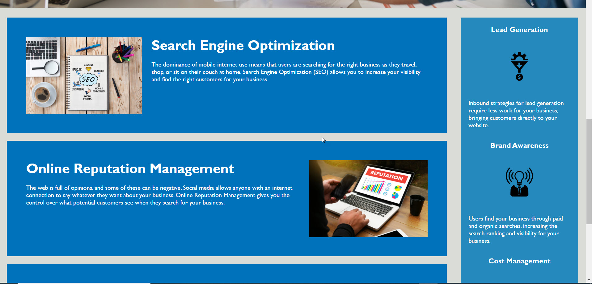

# Code Refactor Starter Code
This project is refactoring a starter code for a website.

# Motivation
This project is meant to test our abilities of being able to look at an HTML and CSS file and be able to condense and clean them up. It's to help make HTML and CSS files as efficient as possible while meeting acceptance criteria.

# Tech/framework used
-HTML
-CSS

# Credits
[Starter Code] (https://github.com/coding-boot-camp/urban-octo-telegram)

# Screenshots

